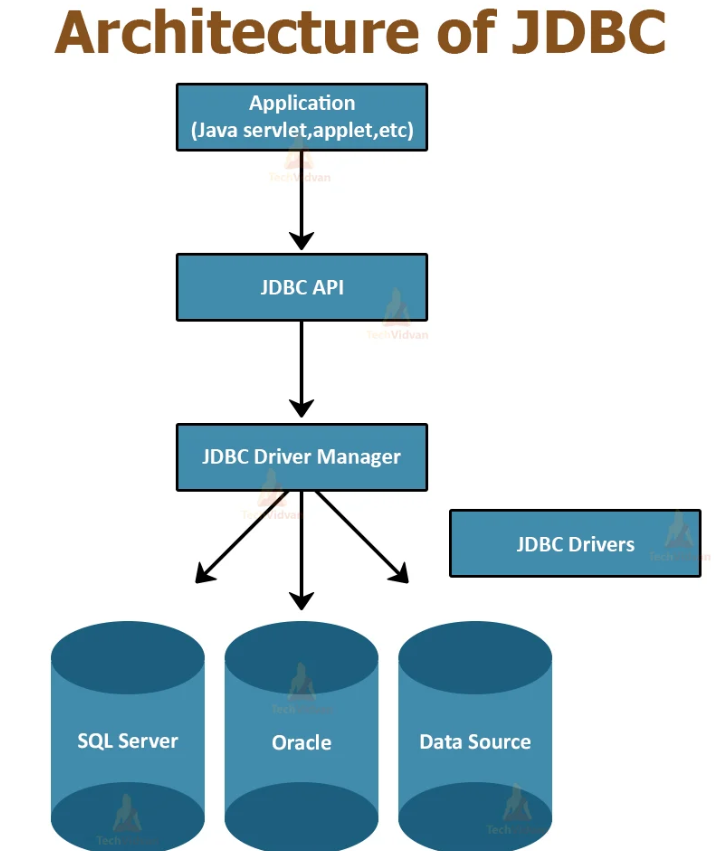

This article is summarized by LLM from this video: 
https://youtu.be/03rDqI6lxdI?si=tAcGsTlzGz3iJYC4
## Overview
**Java Database Connectivity (JDBC)** is the foundational API that enables Java applications to connect to and interact with external databases. JDBC provides a standardized interface for executing SQL queries, updates, and managing database connections across different database management systems.
### Prerequisites
To effectively work with JDBC, developers should possess:
- Basic Java programming knowledge
- Fundamental SQL understanding (SELECT, UPDATE, DELETE statements)
- Familiarity with basic database concepts
## Core JDBC Components

### JDBC Architecture
The JDBC architecture consists of several key components that work together to facilitate database connectivity:
**1. JDBC Driver**
The JDBC driver is vendor-specific software that enables communication between Java applications and specific databases. Each database system (MySQL, PostgreSQL, H2, etc.) requires its corresponding driver.
- Drivers are available through Maven Central
- Must be present on the classpath for JDBC operations
- Acts as the intermediary between Java code and the database

**2. JDBC Driver Manager**
The Driver Manager manages database connections and requires a JDBC URL to establish connectivity.

**3. JDBC URL Structure**
The JDBC URL is a text string that specifies:
- **Protocol**: `jdbc`
- **Database type**: `mysql`, `postgresql`, `h2`, etc.
- **Database name/schema**: The specific database to connect to.

Example format:
```
jdbc:[database_type]:[database_name]
```

**4. Connection Object**
Once the Driver Manager processes the JDBC URL, it returns a Connection object that serves as the gateway for all database operations.

https://techvidvan.com/tutorials/wp-content/uploads/sites/2/2020/06/Architecture-of-JDBC.jpg
## Project Setup
### Maven Configuration
Add the H2 database dependency to your `pom.xml`:
```xml
<dependencies>
    <dependency>
        <groupId>com.h2database</groupId>
        <artifactId>h2</artifactId>
        <version>[version]</version>
        <scope>runtime</scope>
    </dependency>
</dependencies>
```
**Important**: Ensure the scope is set to `runtime` or `compile`, not `test`, otherwise the driver will not be available during execution.
### Basic Database Connection
```java
import java.sql.Connection;
import java.sql.DriverManager;

public class JdbcToDoList {
    public static void main(String[] args) throws Exception {
        String jdbcUrl = "jdbc:h2:./todo;AUTO_SERVER=TRUE";
        var connection = DriverManager.getConnection(jdbcUrl);
    }
}
```

**Connection URL Parameters**:
- `./todo`: Creates database in current project directory
- `AUTO_SERVER=TRUE`: Enables multiple simultaneous connections

## H2 Database Console
The H2 database includes a web-based administrative console for database management.

**Accessing the Console**:
1. Navigate to Maven Dependencies → h2.jar → tools
2. Run `org.h2.tools.Console` as Java Application
3. Connect using the same JDBC URL with `AUTO_SERVER=TRUE`
## CRUD Operations
### Create - Creating Tables
```java
String createTableSQL = "CREATE TABLE IF NOT EXISTS task (" +
    "id IDENTITY PRIMARY KEY, " +
    "name VARCHAR(255))";

var statement = connection.createStatement();
statement.execute(createTableSQL);
```
### Create - Inserting Records
**Using Statement (Hard-coded values)**:
```java
String insertQuery = "INSERT INTO task (name) VALUES ('learn Java')";
statement.execute(insertQuery);
```

**Using PreparedStatement (Parameterized queries)**:
```java
String insertStatement = "INSERT INTO task (name) VALUES (?)";
var preparedStatement = connection.prepareStatement(insertStatement);
preparedStatement.setString(1, "learn Spring");
preparedStatement.execute();
```
PreparedStatement is the preferred approach for queries with dynamic values as it:
- Prevents SQL injection
- Improves performance for repeated queries
- Provides type safety
### Update - Modifying Records
```java
String updateCommand = "UPDATE task SET name = ? WHERE name = ?";
var preparedStatement = connection.prepareStatement(updateCommand);
preparedStatement.setString(1, "learn Jakarta EE");
preparedStatement.setString(2, "learn Java");
preparedStatement.execute();
```
### Delete - Removing Records
```java
String deleteQuery = "DELETE FROM task WHERE name = 'learn Jakarta EE'";
statement.execute(deleteQuery);
```
### Read - Querying Records
```java
String selectAllQuery = "SELECT * FROM task";
var resultSet = statement.executeQuery(selectAllQuery);

while (resultSet.next()) {
    System.out.println("To-do item: " + resultSet.getString("name"));
}
```
**ResultSet Methods**:
- `next()`: Advances to the next record
- `getString(columnName)`: Retrieves string value by column name
- `getString(columnIndex)`: Retrieves string value by column index (1-based)
- `getInt(columnName/columnIndex)`: Retrieves integer value
## Object-Oriented JDBC Implementation
### Domain Model
```java
public class Task {
    private int id;
    private String name;
    
    // Default constructor
    public Task() {}
    
    // Constructor with name only
    public Task(String name) {
        this.name = name;
    }
    
    // Constructor with all fields
    public Task(int id, String name) {
        this.id = id;
        this.name = name;
    }
    
    // Getters and setters omitted for brevity
}
```
### Repository Pattern
The Repository pattern encapsulates data access logic and provides an object-oriented interface for database operations.
```java
public class TaskRepository {
    
    private static HikariDataSource getDataSource() {
        var dataSource = new HikariDataSource();
        dataSource.setJdbcUrl("jdbc:h2:./todo;AUTO_SERVER=TRUE");
        return dataSource;
    }
    
    public void create(Task task) throws SQLException {
        String insertStatement = "INSERT INTO task (name) VALUES (?)";
        
        try (var connection = getDataSource().getConnection()) {
            var preparedStatement = connection.prepareStatement(insertStatement);
            preparedStatement.setString(1, task.name);
            preparedStatement.execute();
        }
    }
    
    public void update(Task task) throws SQLException {
        String updateCommand = "UPDATE task SET name = ? WHERE id = ?";
        
        try (var connection = getDataSource().getConnection()) {
            var preparedStatement = connection.prepareStatement(updateCommand);
            preparedStatement.setString(1, task.name);
            preparedStatement.setInt(2, task.id);
            preparedStatement.execute();
        }
    }
    
    public void deleteAll() throws SQLException {
        try (var connection = getDataSource().getConnection()) {
            var statement = connection.createStatement();
            statement.execute("DELETE FROM task");
        }
    }
    
    public List<Task> findAll() throws SQLException {
        List<Task> tasks = new ArrayList<>();
        String selectQuery = "SELECT * FROM task";
        
        try (var connection = getDataSource().getConnection()) {
            var statement = connection.createStatement();
            var resultSet = statement.executeQuery(selectQuery);
            
            while (resultSet.next()) {
                Task task = new Task(
                    resultSet.getInt(1),    // id column
                    resultSet.getString(2)  // name column
                );
                tasks.add(task);
            }
        }
        
        return tasks;
    }
}
```
### Using the Repository
```java
public static void main(String[] args) {
    TaskRepository taskRepository = new TaskRepository();
    
    try {
        // Create
        Task task = new Task("make your bed");
        taskRepository.create(task);
        
        // Update
        Task task2 = new Task(11, "clean your room");
        taskRepository.update(task2);
        
        // Read
        List<Task> tasks = taskRepository.findAll();
        for (Task taskX : tasks) {
            System.out.println(taskX.name);
        }
        
    } catch (SQLException e) {
        e.printStackTrace();
    }
}
```
## Connection Pooling
### HikariCP Integration
Connection pooling improves performance by reusing database connections instead of creating new ones for each operation.
**Maven Dependency**:
```xml
<dependency>
    <groupId>com.zaxxer</groupId>
    <artifactId>HikariCP</artifactId>
    <version>[version]</version>
</dependency>
```
**Benefits of Connection Pooling**:
- Reduces overhead of creating new connections
- Improves application performance
- Manages connection lifecycle efficiently
- Standard practice in production applications
## Best Practites
### Exception Handling
Proper exception handling is critical in database operations:
```java
try (var connection = getDataSource().getConnection()) {
    // Database operations
} catch (SQLException e) {
    // Handle exception appropriately
    e.printStackTrace();
}
```
### Try-with-Resources
The try-with-resources statement automatically closes connections:
```java
try (var connection = getDataSource().getConnection();
     var statement = connection.createStatement()) {
    // Database operations
}
// Connection and statement automatically closed
```
This ensures proper resource cleanup even if exceptions occur.
### PreparedStatement vs Statement
**Use PreparedStatement when**:
- Query contains dynamic values
- Same query executed multiple times
- Protection against SQL injection required
**Use Statement when**:
- Query is completely static
- One-time execution
- No user input involved
## Common Issues and Solutions
### Driver Not Found Error
**Problem**: `ClassNotFoundException` or driver not available
**Solutions**:
1. Verify Maven dependency scope is `runtime` or `compile`, not `test`
2. Ensure `pom.xml` is saved
3. Run Maven install to download dependencies
4. Check that JAR file appears in Maven Dependencies
### Connection Refused Error
**Problem**: Cannot connect to database
**Solutions**:
1. Verify JDBC URL is correct
2. Add `AUTO_SERVER=TRUE` for H2 to allow multiple connections
3. Ensure database file path is accessible
4. Check database service is running (for server-based databases)
### SQL Syntax Errors
**Problem**: Malformed SQL statements
**Solutions**:
1. Verify SQL syntax matches database dialect
2. Check for typos in table/column names
3. Ensure proper use of single quotes for string values
4. Validate placeholder count matches setString/setInt calls
## Next Steps
After mastering JDBC fundamentals, developers can progress to:
- **Spring JDBC Template**: Simplified JDBC operations with Spring
- **Java Persistence API (JPA)**: Object-relational mapping standard
- **Hibernate**: Popular JPA implementation with advanced features
- **Spring Data**: Repository abstraction layer
- **Transaction Management**: Advanced database transaction handling
## Summary
JDBC provides the foundation for database connectivity in Java applications. Understanding JDBC concepts, connection management, CRUD operations, and the Repository pattern prepares developers for enterprise-level frameworks that abstract JDBC complexity while maintaining the same underlying principles.

The progression from procedural JDBC code to object-oriented repository patterns demonstrates how enterprise frameworks like Spring Data and Hibernate build upon JDBC fundamentals to provide cleaner, more maintainable code.

---
## More to read:
### Maven and Gradle:
https://www.geeksforgeeks.org/java/difference-between-gradle-and-maven/
https://www.javacodegeeks.com/2024/09/maven-and-gradle-a-side-by-side-comparison.html
### ORMs and Raw SQL:
https://dev.to/hamzaj/raw-sql-or-orms-why-orms-are-a-preferred-choice-3dcl
https://www.techtarget.com/searchSoftwareQuality/tip/ORM-vs-SQL-When-to-use-each